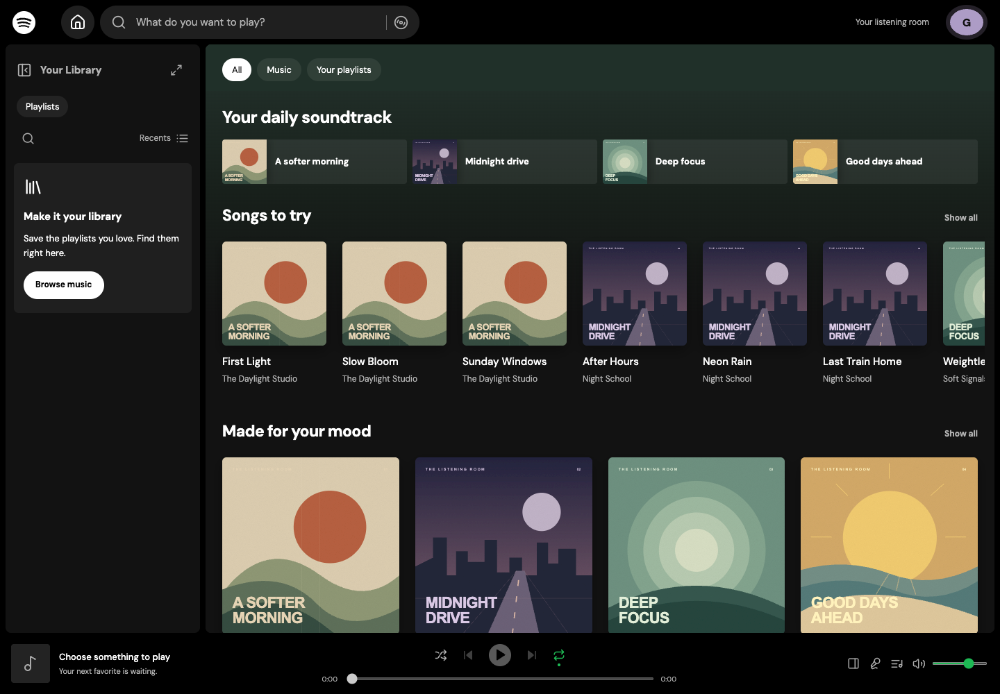

# Spotify — The Listening Room

A Spotify-inspired home and library experience built for the F26 ProductSC Developer Challenge. Browse four curated playlists, explore song details, search twelve original instrumental tracks, listen with a persistent audio player, and save playlists to your library.



## Run locally

Requires **Node.js 22+ and npm**. No API keys, accounts, database, or environment variables are needed for the app. Check your installation with `node --version` and `npm --version` in a terminal. If either command is unavailable, install Node.js with npm and reopen the terminal.

Download or clone the project first. The examples below assume its folder is named `F26 ProductSC Developer Challenge` and is on your Desktop; adjust the path to match where you saved it.

### macOS

Open **Terminal** and run:

```sh
cd "$HOME/Desktop/F26 ProductSC Developer Challenge"
npm install
npm run dev
```

### Windows

Open **PowerShell** and run:

```powershell
cd "$HOME\Desktop\F26 ProductSC Developer Challenge"
npm install
npm run dev
```

If your Desktop is inside OneDrive or the folder has a different name, use its actual path. If PowerShell blocks `npm.ps1`, use `npm.cmd install` and `npm.cmd run dev` instead.

### Open, stop, and restart the app

Open the **Local** address printed in the terminal, usually `http://localhost:5173`. If that port is already in use, Vite may print a different port. Keep the terminal running while using the app. This starts a local development server on your computer; it does not publish the project to a public hosting service.

To stop it, focus the terminal running the server and press **Ctrl+C**. On Mac, this means **Control+C**, not Command+C. If Windows asks whether to terminate the batch job, enter `Y`. Closing only the browser tab does not stop the server. Stopping it leaves your project files intact.

To restart, open a terminal in the project folder and run `npm run dev`. You generally only need `npm install` on first setup or after dependencies change. When transferring the project between Mac and Windows, install dependencies on the destination computer rather than copying `node_modules`.

If a coding assistant started the preview through a chat, it may be running in an assistant-managed terminal session rather than a Terminal window you opened. Ask the assistant in that chat to **stop the local preview server**. The Ctrl+C instructions above apply to a server you started in your own terminal. A preview being available now does not mean it will start automatically after a restart or on another computer.

### Checks and production preview

These commands work on both Mac and Windows:

```sh
npm run typecheck
npm test
npm run build
npm run preview
```

`npm run build` writes the production app to `dist/`. `npm run preview` starts another local server for that build; open the address it prints and stop it with **Ctrl+C** as well. A future static host must rewrite application routes to `index.html`; audio and artwork are ordinary static files.

The repository includes a pnpm lockfile. If you use **pnpm 11+**, run `pnpm install --frozen-lockfile` to install the locked dependencies, then `pnpm dev`. The other equivalents are `pnpm typecheck`, `pnpm test`, `pnpm build`, and `pnpm preview`. npm is supported, but it does not use the pnpm lockfile. Choose one package manager for your checkout.

## Publish on GitHub Pages

The deployment workflow is configured for the repository `YGMssMGY/F26-ProductSC-Developer-Challenge`. Publishing still requires pushing these changes and enabling Pages on GitHub:

1. In GitHub Desktop, review and commit the changes, then **Push origin** to `main`.
2. In the GitHub repository, open **Settings → Pages → Build and deployment**, and choose **GitHub Actions** as the source.
3. Under **Actions**, open **Deploy Listening Room to GitHub Pages**. If the first run happened before Pages was enabled, run it again using **Run workflow**.
4. After the workflow succeeds, open `https://ygmssmgy.github.io/F26-ProductSC-Developer-Challenge/`.

The workflow uses Node.js 24 and pnpm 11, installs the committed lockfile, runs unit tests, type-checks/builds the app, and verifies the production routes and media in Chromium before publishing `dist/`. Later pushes to `main` deploy automatically. GitHub hosts the published app; your Mac does not need to keep running.

To check the same build locally on Mac or Windows:

```sh
npm run build:pages
npm run preview:pages
```

Open the preview address with `/F26-ProductSC-Developer-Challenge/` appended, normally `http://127.0.0.1:4173/F26-ProductSC-Developer-Challenge/`. Stop this preview with **Ctrl+C**. For automated production checks after building, run `npm run test:e2e:pages` (install the Playwright browser as described below first).

The Pages build uses hash routes, for example `/F26-ProductSC-Developer-Challenge/#/playlist/morning`, so direct links and refreshes work without server rewrite rules. Audio, artwork, scripts, and the original headphones favicon all use the repository base path. The usual `npm run dev` and `npm run build` keep root-based browser routes. If you rename the repository, update the Pages base in `vite.config.ts`, the production test configuration and expectations, and these URLs. A custom domain would need its own base-path configuration.

The favicon includes 16px/32px PNG files, a multi-size ICO fallback, and a 180px Apple touch icon, all generated from `public/favicon.svg`. Versioned icon URLs help browsers refresh previously cached icons. If an older icon remains after a successful deployment, close and reopen the site tab. Local file changes do not update the published site until they are committed, pushed, and deployed.

Implementation references: [Vite’s GitHub Pages guide](https://vite.dev/guide/static-deploy#github-pages) and [React Router’s HashRouter](https://reactrouter.com/api/declarative-routers/HashRouter).

## Demo walkthrough

1. On Home, **All**, **Music**, and **Your playlists** filter the feed in place. All three chips stay visible and show the selected filter. Saved-only results include an empty state; the URL remembers the filter for refresh and Back/Forward. Open **A softer morning** by clicking its artwork or title. The separate green play buttons start music without navigating.
2. Click **First Light** in the playlist to read its description and instrumental lyrics state. Press its play button to listen; opening another song’s details leaves playback running.
3. At widths of 700px and above, the right-hand **Now Playing** panel opens on first playback. Bottom **artwork** toggles it. **Expand** opens a large artwork view without changing the browsing URL; **Minimize** or Escape restores the panel and keyboard focus. Playback continues throughout.
4. Click the bottom **song title** to open its release and highlight the song. The panel’s collection heading opens the playback source separately. Artist names open artist pages.
5. Pause, resume, seek, and skip tracks. **Repeat** cycles queue → song → off. Off stops automatic playback after the final song; manual Next/Previous wrap. Next while repeating one song switches to queue repeat. Previous after more than three seconds restarts the current song; before that it goes back. The three-second boundary is a demo choice, not a verified Spotify threshold.
6. Enable **Shuffle** without restarting the current song. **Queue** shows upcoming songs even with Repeat One enabled. Select an entry to play it; disable Shuffle to restore original order. The playlist’s green play button pauses/resumes its own active queue.
7. Open a song’s **…** menu to add it to the queue, visit its release or artist, or view details and credits. Added songs play next in insertion order; duplicates are allowed. Adding to an empty queue selects the song but waits for Play. A brief message confirms each addition.
8. Open **Lyrics** to see the active song’s lyrics state. All twelve original tracks are instrumental, so the demo explains that no lyrics are available.
9. Type `Paloma`, `First Light`, or `morning` in the header. Suggestions appear over the current page. Use arrow keys and Enter to open a suggestion, or submit/View all for full results. Try **All / Songs / Playlists**, an unmatched query, Clear, and Back/Forward. Playing a search result queues the displayed song results.
10. Save a playlist with **+**. Open the **G avatar** for **Profile**, **Recents**, **Settings**, and **About this demo**. Settings is a full page with shared volume, shuffle, and repeat controls. Escape dismisses menus and the About dialog and restores focus.
11. Refresh: saved playlists, recently played songs, and preferences remain, but audio does not automatically start. At 700–1199px, the library becomes a compact rail and the full bottom transport remains available. Below 700px, artwork opens a Now Playing page with full controls and bottom Home/Search/Library navigation. Click **Your Library** to collapse/open the artwork rail without leaving your browsing page. The sidebar’s **Playlists** chip filters locally; Search only searches saved items. **Recents / Recently added / Alphabetical** and **List / Grid** change the sidebar’s ordering and layout. The separate expand icon opens a full library grid; Minimize or Escape returns to the same page with playback intact. At narrower desktop widths, opening the library makes room by closing the right-hand panel; reopening that panel compacts the library.

## Architecture

- **React + TypeScript + Vite**, React Router, custom CSS, and Lucide icons.
- `src/data.ts`: shared `Track`, `Playlist`, and `Release` types, asynchronous `Catalog`/`Library` contracts, bundled catalog, and resilient local-storage library adapter.
- `src/hooks.tsx`: asynchronous loading/retry and shared saved-library state.
- `src/main.tsx`: app shell, reusable cards/track rows, home, playlist, release, artist, search, library, recents, guest profile, and not-found screens.
- `src/track-page.tsx`: individual song descriptions, lyrics state, and playlist playback entry point.
- `src/player.tsx`: one audio element mounted above routed content, shared controls, playback-source identity, and persistent preferences and listening history. Browser media events drive progress and play state.
- `src/queue.ts`: pure queue creation, shuffle, repeat, manual/automatic transitions, duplicate-safe queue additions, and upcoming-order helpers.
- `src/view-state.tsx` and `src/listening-views.tsx`: independent panel state, desktop Now Playing/Queue panels, expanded and full-page listening views, and live lyrics.
- `src/profile-menu.tsx`: guest dropdown, full Settings page, and focus-trapped About dialog using the shared player.
- `src/sidebar.tsx`: independent library filters, search, ordering, layouts, selection and playback feedback, plus a route-preserving expanded library.
- `src/header-search.tsx`: keyboard-accessible suggestions that preserve the current route until submission.
- `src/track-menu.tsx`: accessible song actions and contextual navigation.
- `src/styles.css`: responsive dark panels, focus states, and reduced-motion support.

Routes: `/?facet=music|playlists` (or `/` for All), `/playlist/:id?track=:trackId`, `/release/:id?track=:trackId`, `/artist/:id`, `/track/:id`, `/now-playing`, `/queue`, `/lyrics`, `/search?q=…&type=…`, `/library`, `/profile`, `/recents`, and `/settings`. Song details stay on the selected song; Now Playing and Lyrics follow the active player. Search submission stores the query in the URL; subsequent submissions replace the current search history entry. Back/Forward restores the query. Panels and expanded Now Playing preserve the browsing route and scroll position.

The catalog contains twelve distinct 32-second instrumental miniatures, with three tracks per playlist and four original release collections using the same audio. Artists, releases, and playlist copy are fictional. Audio is real synthesized music. Saved playlist IDs, listening history, volume, shuffle, and repeat persist locally; playback does not automatically resume after refresh. If storage is blocked or corrupt, the current session remains usable. Queue additions are session-only; backend recommendations and Spotify’s queue-reordering rules are not implemented.

### Adding a backend later

Replace the exported catalog/library adapters while retaining their TypeScript interfaces. Views consume hooks and async methods rather than fixture arrays. An HTTP adapter can map the current methods to endpoints such as playlist listing/detail, all tracks (`listTracks()`), song detail, catalog search, and the current user's saved playlists. `getTrack(id)` returns the song, its owning playlist, and that playlist's ordered tracks, or `null` for an unknown ID. `getRelease(id)` resolves release metadata and its ordered tracks; stable `releaseId` and `artistId` fields distinguish release, artist, and source-playlist navigation. Artist pages currently group `listTracks()` results by artist ID. Each track includes a `description` and `lyrics: string | null`; use `null` for instrumental tracks. Keep stable IDs and return the same domain types. Audio URLs can point to your media storage.

The existing loading, retry, empty, and missing-resource views are already present. When authentication is introduced, create a user-scoped library adapter and clear/reload library state when the session changes. Guest-to-account library migration and the eventual database/API technology are intentionally future decisions. The browser audio controller stays client-side.

## Validation

`npm test` runs Vitest checks for catalog integrity, song metadata and owning playlist resolution, search, missing songs/playlists, persistence, unavailable/corrupt storage, shuffle preservation/restoration, every repeat mode, upcoming order, circular boundaries, and empty/single-track queues.

```sh
npx playwright install chromium
npm run test:e2e
```

To use an existing Chrome installation instead, set `CHROME_PATH` to its executable. On macOS:

```sh
CHROME_PATH="/Applications/Google Chrome.app/Contents/MacOS/Google Chrome" npm run test:e2e
```

Browser tests cover actual media progress, pause/resume, seeking, manual/automatic repeat, one-song replay, stable shuffle, queue selection, playlist-source identity, panel route/scroll continuity, release-row reveal, expanded-view route/scroll/focus restoration, live lyrics, saved profiles, duplicate queue additions, recents, menu keyboard behavior, synchronized settings, failed-media retry, direct URLs, search suggestions/history/filters, Home facet history and uninterrupted playback, sidebar search/sort/layouts and expand/minimize focus, and keyboard-only playback. Layout checks capture Home, the profile menu, and Now Playing at 1440px, 1024px, 760px, and 390px, with no horizontal page overflow.

Automated browser runs use Chromium's `--disable-audio-output` test option: the real WAV files are decoded and their media timelines advance, while the OS audio stream is replaced by a test stream. This avoids host audio-device interruptions in headless runs; it does not change the app. [Chromium's description of the test option](https://chromium.googlesource.com/chromium/src/+/f29eb01290cd36a30177ecf8197f906c01088a0d). Set `E2E_REAL_AUDIO=1` to use physical audio output when verifying on a suitable device.

The interface and playback update is checked with fifteen unit tests, seventeen development browser tests plus three Pages production tests, a type check, and a production build. Desktop, tablet, and mobile screenshots are included for visual review.

Before submission, run the type check, production build, unit tests, and browser tests, then inspect desktop and mobile layouts. Browser tests verify decoded audio playback and time advancement; a final human listening check on the submitting device is recommended for speaker volume and subjective sound quality.

## Assets and credits

See [ASSETS.md](ASSETS.md). All audio and playlist artwork are generated locally from original source, bundled in the repository, and offered under CC0. No Spotify account or Spotify API is used. Google Fonts are an optional network enhancement with system-font fallbacks.

See the [hands-on Spotify comparison and implementation notes](docs/spotify-uiux-comparison.md).

Screenshots: [library sidebar](docs/library-sidebar.png), [expanded library](docs/library-expanded.png), [Home filters on tablet](docs/home-filters-760.png), [expanded player](docs/expanded-1440.png), [compact expanded player](docs/expanded-760.png), [search suggestions](docs/search-suggestions.png), [search results](docs/search-results.png), [desktop home](docs/home-1440.png), [tablet home](docs/home-1024.png), [mobile home](docs/home-390.png), [desktop Now Playing](docs/now-playing-desktop.png), [tablet Now Playing](docs/now-playing-1024.png), [mobile Now Playing](docs/now-playing-390.png), [desktop profile menu](docs/profile-menu-1440.png), [mobile profile menu](docs/profile-menu-390.png).

## Challenge submission checklist

- [x] Recognizable, structured homepage recreation
- [x] Complete browse → playlist → track → playback flow
- [x] Searchable data view
- [x] Responsive layouts, tests, setup guide, asset credits, and demo steps
- [ ] Review and publish the code to a public GitHub repository
- [ ] Email its link to `saniagup@usc.edu`, `avshah@usc.edu`, and `kakolla@usc.edu`
- [ ] Use subject `[NAME] - ProductSC Dev Challenge`; deadline in the brief: Wednesday, September 16 at 12 PM (timezone unspecified)

This is an independent student assessment project, not an official Spotify product. GitHub Pages deployment configuration is included. Authentication, backend implementation, and email submission remain outside this implementation; publishing requires the GitHub steps above.
