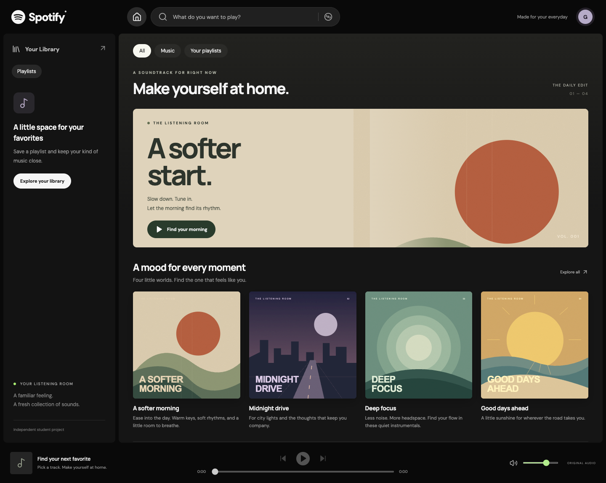

# Spotify — The Listening Room

A Spotify-inspired home and library experience built for the F26 ProductSC Developer Challenge. Browse four curated playlists, search twelve original instrumental tracks, listen with a persistent audio player, and save playlists to your library.



## Run locally

Requires Node.js 22+ and pnpm 11+ (or npm). No API keys, accounts, database, or environment variables are needed for the app.

```sh
pnpm install
pnpm dev
```

Open the local address printed by Vite. Alternatively, `npm install` and `npm run dev` work; the committed dependency lockfile is for pnpm.

```sh
pnpm typecheck
pnpm test
pnpm build
pnpm preview
```

The production app is in `dist/`. A future static host must rewrite application routes to `index.html`; audio and artwork are ordinary static files.

## Demo walkthrough

1. On Home, choose **A softer morning** or **Find your morning**.
2. Select **First Light**. Hear the original instrumental and watch the progress advance.
3. Pause, resume, seek, and skip to the next song. Playback advances automatically and stops after the last track.
4. Return Home while listening; playback continues.
5. Open Search and type `Paloma` (artist), `First Light` (song), or `morning` (playlist). Try an unmatched query and clear it.
6. Open a playlist and tap **+**. Visit Your Library, refresh, and see the saved playlist. The checkmark removes it.
7. Resize to mobile: use the bottom Home/Search/Library navigation and persistent compact player.

## Architecture

- **React + TypeScript + Vite**, React Router, custom CSS, and Lucide icons.
- `src/data.ts`: `Track`, `Playlist`, asynchronous `Catalog` and `Library` contracts, curated fixture adapter, resilient local-storage adapter, and queue boundary logic.
- `src/hooks.tsx`: asynchronous view loading/retry and shared saved-library state.
- `src/main.tsx`: application shell, reusable cards/track rows, home, playlist, search, library, and not-found screens.
- `src/player.tsx`: a single audio element mounted above the routed content. Browser media events drive progress and play state. Navigation never remounts the player.
- `src/styles.css`: responsive layout, focus states, reduced-motion support, and original art direction.

Routes: `/`, `/playlist/:id`, `/search?q=…`, `/library`. Query changes replace the current search history entry to avoid a back-button stop for each keystroke; navigation away and back restores the URL query.

The catalog contains twelve distinct 32-second instrumental miniatures, with three tracks per playlist. Artists and playlist copy are fictional. Audio is real synthesized music, not commercial Spotify streaming. Saved playlist IDs and volume persist locally; playback does not automatically resume after refresh. If storage is blocked or corrupt, the current session remains usable.

### Adding a backend later

Replace the exported catalog/library adapters while retaining their TypeScript interfaces. Views consume hooks and async methods rather than fixture arrays. An HTTP adapter can map the current methods to endpoints such as playlist listing/detail, catalog search, and the current user's saved playlists. Keep stable IDs and return the same domain types. Audio URLs can point to your media storage.

The existing loading, retry, empty, and missing-resource views are already present. When authentication is introduced, create a user-scoped library adapter and clear/reload library state when the session changes. Guest-to-account library migration and the eventual database/API technology are intentionally future decisions. The browser audio controller stays client-side.

## Validation

`pnpm test` runs six Vitest checks for catalog integrity, search, missing playlists, persistence, unavailable/corrupt storage, and queue boundaries.

```sh
pnpm exec playwright install chromium
pnpm test:e2e
```

To use an existing Chrome installation instead, set `CHROME_PATH` to its executable. On macOS:

```sh
CHROME_PATH="/Applications/Google Chrome.app/Contents/MacOS/Google Chrome" pnpm test:e2e
```

Five browser tests cover real media progress, pause/resume, seeking, next/auto-next/end behavior, uninterrupted route navigation, saved state, search and empty results, failed media retry, direct URLs, browser history, keyboard activation, and mobile layout. Screenshot tests update the files in `docs/`.

Verified during implementation: type check, production build, six unit tests, and five Chrome browser tests. Desktop and mobile screenshots were visually inspected. Browser tests verify decoded audio playback and time advancement; a final human listening check on the submitting device is recommended for speaker volume and subjective sound quality.

## Assets and credits

See [ASSETS.md](ASSETS.md). All audio and playlist artwork are generated locally from original source, bundled in the repository, and offered under CC0. No Spotify account or Spotify API is used. Google Fonts are an optional network enhancement with system-font fallbacks.

Screenshots: [desktop](docs/home-desktop.png), [mobile home](docs/home-mobile.png), [mobile playlist](docs/playlist-mobile.png).

## Challenge submission checklist

- [x] Recognizable, structured homepage recreation
- [x] Complete browse → playlist → track → playback flow
- [x] Searchable data view
- [x] Responsive layouts, tests, setup guide, asset credits, and demo steps
- [ ] Review and publish the code to a public GitHub repository
- [ ] Email its link to `saniagup@usc.edu`, `avshah@usc.edu`, and `kakolla@usc.edu`
- [ ] Use subject `[NAME] - ProductSC Dev Challenge`; deadline in the brief: Wednesday, September 16 at 12 PM (timezone unspecified)

This is an independent student assessment project, not an official Spotify product. Deployment, authentication, backend implementation, publication, and email submission are outside this implementation.
